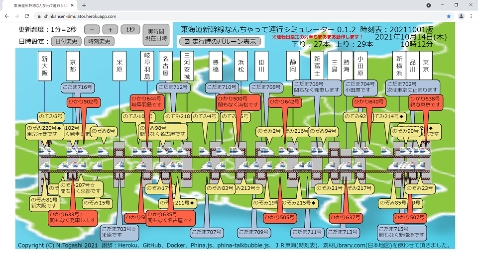

# 東海道新幹線なんちゃって運行シミュレーター
<DIV STYLE="text-align: right;">2021年10月14日 鉄道の日 公開</DIV>

## 概要

　東海道新幹線は、毎日多くの列車が走行していることはご存じのことと思います。
のぞみ号が止まる駅の時刻表を見ると、日中は毎時10本前後の列車（のぞみ号が6本、ひかり号が2本、こだま号が2本）
が発車しており、更に運転日指定の臨時列車も加わることがわかります（上下合わせると倍になります）。
また、東京駅と新大阪駅間の約500Kmを、のぞみ号は約2時間30分、ひかり号は約2時間54分、こだま号は約3時間54分で結んでおり、
上り下りの線路上にはそれぞれ約26本以上（のぞみ号が13本、ひかり号が6本、こだま号が7本）の列車が走行しているようです。
このような状況を見てみたいと考えて作成したのがこの運行シミュレーターです。

　実際の画面がこちらです。

　実際に見てみると想像以上の混雑ぶりでびっくりしました。特にのぞみ号の追い抜きぶりは凄くて、
こだま号やひかり号が可哀想になります。出張ではこだま号を使っていたため身に染みてわかります。

　まだまだ不完全な部分が多いですが、ぼちぼち改善していきたいと考えています。

  - 列車は停車駅間を等速度で走行します。駅内徐行、加速、区間毎の最高速度、カーブでの減速などを実現したい。
  - 追い越しは次の通過駅に近づいた時に停車している列車があれば追い抜きます。通過時間を計算して追い越したい。
  - 各駅の構成や各列車が発着する番線も再現したい。
  - 線路を実際の地図に合わせた曲線にしたい。
  - 通過駅のアナウンスも表示したい。
  - 時刻表はＪＲ東海HPの時刻表から取得させて頂いていますが良い方法があれば改善したい。
  - ソースコードは作成しっぱなしなので整理したいし、テストコードも作成したい。
  - 山陽新幹線、東北新幹線、... まだまだ ...

　公開に際しては以下のサービスを使用させて頂きました。感謝致します。

  - [Heroku](https://heroku.com/)
  - [GitHub](https://github.com/)
  - [Docker Hub](https://hub.docker.com/)

　作成に際しては以下のソフトウェアおよびデータを使用させて頂きました。感謝致します。

  - [Phina.js](https://phinajs.com/)
  - [phina-talkbubble.js](https://github.com/pentamania/phina-talkbubble)
  - [ＪＲ東海](https://jr-central.co.jp/)の時刻表
  - [素材Library.com](https://www.sozai-library.com/)の[日本地図](https://www.sozai-library.com/sozai/2528)
  - [Ubuntu 18.04](https://ubuntu.com/)
  - [Python 3.6](https://www.python.org/)
  - [JPHoliday](https://github.com/Lalcs/jpholiday)
  - [requests-html](https://pypi.org/project/requests-html/)
  - [BeautifulSoup](https://www.crummy.com/software/BeautifulSoup/)

## Herokuで運用中

　以下のリンクから実際の動作を参照できます。※作業中で停止していたらごめんなさい。 m(\_.\_)m

  - <A HREF="https://shinkansen-simulator.herokuapp.com/" TARGET="_blank" REL="noopener noreferrer">東海道新幹線なんちゃって運行シミュレーター</A>

## Dockerコンテナで運用する場合

### 構築手順

  1. GitHubからプロジェクトを取得する。
     ```
     $ git clone --depth 1 https://github.com/togashigg/shinkansen-simulator.git
     ```
  2. プロジェクトのディレクトリに移動する。
     ```
     $ cd shinkansen-simulator
     ```
  3. Dockerイメージをビルドする。
     ```
     $ docker build -t shinkansen-simulator:latest .
     ```
  4. 永続化領域用ディレクトリを作成する。
     ```
     $ mkdir ~/timetable
     $ mkdir ~/timetable/cache
     $ mkdir ~/timetable/log
     $ mkdir ~/timetable/output
     $ mkdir ~/timetable/remarks
     ```
  5. Dockerコンテナを起動する。
     ```
     $ docker run -d --name shinkansen-simulator -p 80:8080 \
              -v ~/timetable/cache:/app/shinkansen_simulator/timetable/cache \
              -v ~/timetable/log:/app/shinkansen_simulator/timetable/log \
              -v ~/timetable/output:/app/shinkansen_simulator/timetable/output \
              -v ~/timetable/remarks:/app/shinkansen_simulator/timetable/remarks \
              shinkansen-simulator
     ```
  8. ブラウザでDockerコンテナのURLを開く。
     ```
     http://＜IPアドレス＞/
     
      ※＜IPアドレス＞には環境を構築したサーバのIPアドレスを指定してください。
     ```

### 最新の時刻表に更新する方法

　時刻表データ利用についてはＪＲ東海の許可を得ておりません。利用する際は自己責任で利用して下さい。

　なお、運転日指定列車の時刻表は運転日にのみ取得できます。全列車の時刻表を完成させるには毎日実行しなければなりません。

  1. 時刻表の記事ファイルを作成する。

     本プロジェクトの"shinkansen_simulator/timetable/remarks/"内のファイルを参考にして、
     最新の時刻表から記事ファイルを作成して、永続化用ディレクトリの"remarks"ディレクトリに
     格納する。

     ファイル名は以下の通りとする。
     ```
       時刻表_YYMMDD_MMDD_記事.csv
       
         ※YYMMDD：時刻表の開始日を西暦年の下2桁と月日を指定する。例：211001
         ※MMDD　：時刻表の終了日を月日で指定する。例：1031
     ```

  2. 以下のコマンドを実行してＪＲ東海HPより時刻表データを取得する。
     ```
     $ docker exec shinkansen-simulator /bin/bash -c \
              'cd /app/shinkansen_simulator/timetable/; ./get.sh ＜時刻表開始日＞ ＜時刻表終了日＞'
     
       ※＜時刻表開始日＞：時刻表の開始日をYYYYMMDDの８桁の数字で指定する。例：20211001
       ※＜時刻表終了日＞：時刻表の終了日をYYYYMMDDの８桁の数字で指定する。例：20211031
       ※実行時間は、初回および各月の1日は約4時間、その他は約20分～40分程度です。
     ```

### Herokuでの構築手順（作成者メモ）

#### Herokuにユーザ登録する

  1. Herokuのユーザでない場合は、以下のURLを開いて新規登録を行う。

     https://heroku.com/

#### Herokuにログインする

  1. Herokuの以下のURLを開いてログインする。

     https://heroku.com/

#### 新規のアプリを作成する

  1. Herokuにログインしたアプリ一覧の画面で\[New\]-\[Create new app\]を選択する。

     \[Create New App\]画面が表示される。

  2. 各項目に値を入力する。

     \[App name\]：

       公開するアプリの名前を英字で始まる英数字で入力する。Herokuアプリ内で一意な名前でなければならない。

     \[Choose a region\]：

       デフォルトで表示される値(United States)のままとする。

     \[Add to pipeline...\]：

       デフォルトのまな何もしない。

  3. \[Create app\]ボタンをクリックする。

     アプリ画面が表示される。

#### GitHubとの連携を設定する

  1. \[Deployment method\]項目の\[GitHub\]をクリックする。

     \[Deploy using Heroku Git\]項目が\[Deploy using Heroku Git\]項目に変化する。

  2. \[Deploy using Heroku Git\]項目の\[Connect GitHub\]

     \[Sign in to GitHub\]画面が表示される。

  3. \[Sign in to GitHub\]画面にユーザIDとパスワードを入力して\[Sign in\]ボタンをクリックする。

     \[Authorize application\]画面が表示される。

  4. \[Authorize heoku\]ボタンをクリックする。

     \[Connect to GitHub\]項目に\[Search for a repository to connect to\]に表示される

  5. \[Search for a repository to connect to\]の\[Search\]ボタンをクリックする。

     GitHubのリポジトリ一覧が表示される。

  6. 該当リポジトリの右横の\[Connect\]ボタンをクリックする。

     今回の場合は、\[togashigg/shinkansen-simulator\]の横の\[Connect\]ボタンをクリックする。

#### アプリをデプロイする

  1. herokuの\[Deploy\]タブをクリックする。

  2. \[Manual deploy\]項目の\[Deploy Branch\]ボタンをクリックする。

     デプロイログが下方に表示される。

## 使用サービスおよび使用ソフトウェアのライセンスおよびポリシー

  - [Heroku](https://heroku.com/)
    ```
    Acceptable Use and External-Facing Services Policy
    ...
    7. U.S. Digital Millennium Copyright Act or Similar Statutory Obligations
    A. To the extent a customer uses the services for hosting, advertising, sending electronic messages, or for the creation and hosting of, or for posting material on, websites, each customer must:
    
    I. Comply with any notices received under Title II of the Digital Millennium Copyright Act of 1998 (Section 512 of the U.S. Copyright Act) or similar statute in other countries (the “DMCA”);
    II. Set up a process to expeditiously respond to notices of alleged infringement that comply with the DMCA and to implement a DMCA-compliant repeat infringers policy;
    III. Publicly display a description of its notice and takedown process under the DMCA on its instance of the services; and
    IV. Comply with such processes, policy(ies), and description.
    B. It is SFDC’s policy to respond expeditiously to valid notices of claimed copyright infringement compliant with the DMCA. In appropriate circumstances, SFDC will terminate the accounts of customers who SFDC suspects to be repeatedly or blatantly infringing copyrights.
    
    C. If SFDC receives a notice alleging that material on a customer’s instance of a service infringes another party’s intellectual property, SFDC may disable that customer’s instance of the service or remove the allegedly infringing material. If SFDC receives more than one such notice for the same customer, SFDC reserves the right to immediately terminate such customer’s subscriptions to the services as deemed necessary by SFDC to ensure continued protection under the safe harbor provisions under the DMCA or to prevent violations of other applicable laws or third parties’ rights.
    ---
    © 2021 Salesforce.com
    ```

  - [GitHub](https://github.com/)
    ```
    Site Policy on GitHub
    ...
    License
    CC0-1.0. Note that CC0-1.0 does not grant any trademark permissions.
    
    You're under no legal obligation to do so, but in the spirit of transparency and collaboration these policies are developed and shared with, you're encouraged to:
    
    Share your adapted policies under CC0-1.0 or other open terms
    Make your adaptations transparent by using a public repo to show changes you've made
    Let us know how you're using adapted policies
    ...
    ---
    © 2021 GitHub, Inc.
    ```

  - [Docker Hub](https://hub.docker.com/)
    ```
    Docker Terms of Service
    Effective as of: December 14, 2020
    ...
    16. Copyright Policy
    16.1 Docker has established the following process to respond to notices of alleged infringement that comply with the United States' Digital Millennium Copyright Act ("DMCA notices").
    
    16.2 If you believe that your copyrighted work has been copied in a way that constitutes copyright infringement and is accessible via the Service, please notify Docker's copyright agent, as set forth in the Digital Millennium Copyright Act of 1998 (DMCA). For your complaint to be valid under the DMCA, you must provide the following information in writing:
    
    a. An electronic or physical signature of a person authorized to act on behalf of the copyright owner;
    
    b. Identification of the copyrighted work that you claim is being infringed;
    
    c. Identification of the material that is claimed to be infringing and where it is located on the Service;
    
    d. Information reasonably sufficient to permit Docker to contact you, such as your address, telephone number, and e-mail address;
    
    e. A statement that you have a good faith belief that use of the material in the manner complained of is not authorized by the copyright owner, its agent, or law; and
    
    f. A statement, made under penalty of perjury, that the above information is accurate, and that you are the copyright owner or are authorized to act on behalf of the owner.
    
    Docker's Designated Copyright Agent to receive notifications of claimed infringement can be reached as follows:
    
    Attention: Copyright Agent
    Docker, Inc.
    3790 El Camino Real #1052
    Palo Alto CA 94306
    
    
    Email: dmca@docker.com
    
    For clarity, only DMCA notices should go to the Docker Designated Copyright Agent. Any other feedback, comments, requests for technical support or other communications should be directed to Docker through support@docker.com.
    ...
    ---
    © 2021 Docker Inc. All rights reserved
    ```

  - [Phina.js](https://phinajs.com/)
    ```
    phinajs/phina.js is licensed under the
    MIT License
    A short and simple permissive license with conditions only requiring preservation of copyright and license notices. Licensed works, modifications, and larger works may be distributed under different terms and without source code.
    ---
    MIT License

    Copyright (c) 2015 phi and other contributors, http://phinajs.com

    Permission is hereby granted, free of charge, to any person obtaining a copy
    of this software and associated documentation files (the "Software"), to deal
    in the Software without restriction, including without limitation the rights
    to use, copy, modify, merge, publish, distribute, sublicense, and/or sell
    copies of the Software, and to permit persons to whom the Software is
    furnished to do so, subject to the following conditions:

    The above copyright notice and this permission notice shall be included in all
    copies or substantial portions of the Software.

    THE SOFTWARE IS PROVIDED "AS IS", WITHOUT WARRANTY OF ANY KIND, EXPRESS OR
    IMPLIED, INCLUDING BUT NOT LIMITED TO THE WARRANTIES OF MERCHANTABILITY,
    FITNESS FOR A PARTICULAR PURPOSE AND NONINFRINGEMENT. IN NO EVENT SHALL THE
    AUTHORS OR COPYRIGHT HOLDERS BE LIABLE FOR ANY CLAIM, DAMAGES OR OTHER
    LIABILITY, WHETHER IN AN ACTION OF CONTRACT, TORT OR OTHERWISE, ARISING FROM,
    OUT OF OR IN CONNECTION WITH THE SOFTWARE OR THE USE OR OTHER DEALINGS IN THE
    SOFTWARE.
    ---
    Copyright © 2015 phi. All Rights Reserved.
    ```

  - [phina-talkbubble.js](https://github.com/pentamania/phina-talkbubble)
    ```
    LICENSE
    MIT
    ---
    Copyright (C) pentamania, https://github.com/pentamania
    ```

  - [ＪＲ東海](https://jr-central.co.jp/)の時刻表
    ```
    著作権について
    当サイトの著作権及び当サイトに含まれる文章、写真、映像、音楽、音声その他の著作物に関する著作権は、当社又は原著作者その他の権利者に帰属します。当サイトの著作物に関して、著作権法により認められている場合を除き、権利者の許諾なく複製、改変、転用、貸与、頒布、公衆送信その他一切の利用・処分等を行うことを禁止します。
    商標権について
    当サイトに掲載される当社の商号、商標、ロゴマーク等に関する権利は、当社に帰属します。これらを当社の許諾なく利用・処分等することを禁止します。
    ---
    ©Central Japan Railway Company All rights reserved.
    ```

  - [素材Library.com](https://www.sozai-library.com/)の日本地図
    ```
    ご利用規約
    すべての素材データを、個人利用法人利用問わず無料でダウンロードしお使いいただけますが、素材データの著作権は管理者に帰属しますので、著作権を侵害する行為は禁止させていただきます。 また、イラスト素材はJPGとEPSもしくはAI形式（まとめてZIPでダウンロードできます）（一部、EPS・AIデータが無いのもあり）が入ってますので、必要に応じて加工は自由にしていただいて問題ありませんが、注意点が少しありますので下記「ご利用に関してのお願い」をお読みくださいませ。

    ■ご利用に関してのお願い
    ・当サイトの素材の販売は禁止させていただきます。
    ・当サイトの素材の再配布は禁止させていただきます。
    ・当サイトの素材を加工した素材の配布も禁止させていただきます。
    ・会社・企業・団体などでの当サイトのイラストの使用は問題ありません。
    ・アダルト、公序良俗、宗教系、その他管理人が不快に感じるサイトや媒体で、当サイトのイラスト素材の利用は禁止しています。
    ・販売物への使用は禁止しています。
    ・当サイトのイラストを使用して、直接的（※1）・間接的（※2）に利益を得ることを禁止しています。
    ・※1 直接的とは、当サイトの素材を直接販売もしくは加工して販売することをさします。
    ・※2 間接的とは、当サイトの素材がきっかけもしくは当サイトの素材が無いと何か販売できない状態、または利益を出せない状態で使用されることをさします。
    ・当サイトのイラストの利用、ダウンロードに発生した障害や事故などに関していかなる保証も行いません。
    ・当サイトからのリンクを通じアクセスされるサービス、ウェブサイトについて、いかなる責任も負いません。
    ■免責事項
    ・当サイトのイラストデータをご利用いただく場合には、お客様のご判断と責任におきましてご利用をお願い申し上げます。
    ・イラスト素材データに関してのトラブルは当サイトでは、一切の責任を負いかねます事ご了承願います。
    ・カレンダー素材、地図素材の内容関しては万全を期してはおりますが、正確性、確実性を保証するものではありません。今後、予告なしに内容を変更または廃止する場合があります。
    ・地図素材のデータに関しては2014年7月に作成したデータとなります。市区町村合併などによりデータが古い場合がありますので、国土交通省などの地図と照らし合わせご利用することをおすすめいたします。
    ・イラスト素材データに関してのご質問に関しては、お答え致しかねる場合もございますのでご了承ください。
    ---
    Copyright(c)2012-2021 無料イラストの素材ライブラリー.com ALL RIGHTS RESERVED.
    ```

  - [Ubuntu 18.04](https://ubuntu.com/)
    ```
    Licensing
    Ubuntu is a collection of thousands of computer programs and documents created by a range of individuals, teams and companies.
    Each of these programs may come under a different licence. This licence policy describes the process that we follow in determining which software will be included by default in the Ubuntu operating system.

    Copyright licensing and trademarks are two different areas of law, and we consider them separately in Ubuntu. The following policy applies only to copyright licences. We evaluate trademarks on a case-by-case basis.

    Further information on our intellectual property policy ›
    ...
    ---
    © 2021 Canonical Ltd. Ubuntu and Canonical are registered trademarks of Canonical Ltd.
    ```

  - [Python 3.6](https://www.python.org/)
    ```
    Terms and conditions for accessing or otherwise using Python
    PSF LICENSE AGREEMENT FOR PYTHON 3.6.15
    1. This LICENSE AGREEMENT is between the Python Software Foundation ("PSF"), and
       the Individual or Organization ("Licensee") accessing and otherwise using Python
       3.6.15 software in source or binary form and its associated documentation.

    2. Subject to the terms and conditions of this License Agreement, PSF hereby
       grants Licensee a nonexclusive, royalty-free, world-wide license to reproduce,
       analyze, test, perform and/or display publicly, prepare derivative works,
       distribute, and otherwise use Python 3.6.15 alone or in any derivative
       version, provided, however, that PSF's License Agreement and PSF's notice of
       copyright, i.e., "Copyright © 2001-2021 Python Software Foundation; All Rights
       Reserved" are retained in Python 3.6.15 alone or in any derivative version
       prepared by Licensee.

    3. In the event Licensee prepares a derivative work that is based on or
       incorporates Python 3.6.15 or any part thereof, and wants to make the
       derivative work available to others as provided herein, then Licensee hereby
       agrees to include in any such work a brief summary of the changes made to Python
       3.6.15.

    4. PSF is making Python 3.6.15 available to Licensee on an "AS IS" basis.
       PSF MAKES NO REPRESENTATIONS OR WARRANTIES, EXPRESS OR IMPLIED.  BY WAY OF
       EXAMPLE, BUT NOT LIMITATION, PSF MAKES NO AND DISCLAIMS ANY REPRESENTATION OR
       WARRANTY OF MERCHANTABILITY OR FITNESS FOR ANY PARTICULAR PURPOSE OR THAT THE
       USE OF PYTHON 3.6.15 WILL NOT INFRINGE ANY THIRD PARTY RIGHTS.

    5. PSF SHALL NOT BE LIABLE TO LICENSEE OR ANY OTHER USERS OF PYTHON 3.6.15
       FOR ANY INCIDENTAL, SPECIAL, OR CONSEQUENTIAL DAMAGES OR LOSS AS A RESULT OF
       MODIFYING, DISTRIBUTING, OR OTHERWISE USING PYTHON 3.6.15, OR ANY DERIVATIVE
       THEREOF, EVEN IF ADVISED OF THE POSSIBILITY THEREOF.

    6. This License Agreement will automatically terminate upon a material breach of
       its terms and conditions.

    7. Nothing in this License Agreement shall be deemed to create any relationship
       of agency, partnership, or joint venture between PSF and Licensee.  This License
       Agreement does not grant permission to use PSF trademarks or trade name in a
       trademark sense to endorse or promote products or services of Licensee, or any
       third party.

    8. By copying, installing or otherwise using Python 3.6.15, Licensee agrees
       to be bound by the terms and conditions of this License Agreement.
    ---
    © Copyright 2001-2021, Python Software Foundation.
    ```

  - [JPHoliday](https://github.com/Lalcs/jpholiday)
    ```
    Lalcs/jpholiday is licensed under the
    MIT License
    A short and simple permissive license with conditions only requiring preservation of copyright and license notices. Licensed works, modifications, and larger works may be distributed under different terms and without source code.
    ---
    MIT License
    
    Copyright (c) 2017 
    
    Permission is hereby granted, free of charge, to any person obtaining a copy
    of this software and associated documentation files (the "Software"), to deal
    in the Software without restriction, including without limitation the rights
    to use, copy, modify, merge, publish, distribute, sublicense, and/or sell
    copies of the Software, and to permit persons to whom the Software is
    furnished to do so, subject to the following conditions:
    
    The above copyright notice and this permission notice shall be included in all
    copies or substantial portions of the Software.
    
    THE SOFTWARE IS PROVIDED "AS IS", WITHOUT WARRANTY OF ANY KIND, EXPRESS OR
    IMPLIED, INCLUDING BUT NOT LIMITED TO THE WARRANTIES OF MERCHANTABILITY,
    FITNESS FOR A PARTICULAR PURPOSE AND NONINFRINGEMENT. IN NO EVENT SHALL THE
    AUTHORS OR COPYRIGHT HOLDERS BE LIABLE FOR ANY CLAIM, DAMAGES OR OTHER
    LIABILITY, WHETHER IN AN ACTION OF CONTRACT, TORT OR OTHERWISE, ARISING FROM,
    OUT OF OR IN CONNECTION WITH THE SOFTWARE OR THE USE OR OTHER DEALINGS IN THE
    SOFTWARE.
    ```

  - [requests-html](https://pypi.org/project/requests-html/)
    ```
    License: MIT License (MIT)
    The MIT License (MIT)
    
    Copyright 2018 Kenneth Reitz
    
    Permission is hereby granted, free of charge, to any person obtaining a copy
    of this software and associated documentation files (the "Software"), to deal
    in the Software without restriction, including without limitation the rights
    to use, copy, modify, merge, publish, distribute, sublicense, and/or sell
    copies of the Software, and to permit persons to whom the Software is
    furnished to do so, subject to the following conditions:
    
    The above copyright notice and this permission notice shall be included in all
    copies or substantial portions of the Software.
    
    THE SOFTWARE IS PROVIDED "AS IS", WITHOUT WARRANTY OF ANY KIND, EXPRESS OR
    IMPLIED, INCLUDING BUT NOT LIMITED TO THE WARRANTIES OF MERCHANTABILITY,
    FITNESS FOR A PARTICULAR PURPOSE AND NONINFRINGEMENT. IN NO EVENT SHALL THE
    AUTHORS OR COPYRIGHT HOLDERS BE LIABLE FOR ANY CLAIM, DAMAGES OR OTHER
    LIABILITY, WHETHER IN AN ACTION OF CONTRACT, TORT OR OTHERWISE, ARISING FROM,
    OUT OF OR IN CONNECTION WITH THE SOFTWARE OR THE USE OR OTHER DEALINGS IN THE
    SOFTWARE.
    ```

  - [BeautifulSoup](https://www.crummy.com/software/BeautifulSoup/)
    ```
    Attribution-ShareAlike 2.0 Generic (CC BY-SA 2.0)
    This is a human-readable summary of (and not a substitute for) the license. Disclaimer.
    You are free to:
    Share — copy and redistribute the material in any medium or format
    Adapt — remix, transform, and build upon the material
    for any purpose, even commercially.
    This license is acceptable for Free Cultural Works.
    The licensor cannot revoke these freedoms as long as you follow the license terms.
    Under the following terms:
    Attribution — You must give appropriate credit, provide a link to the license, and indicate if changes were made. You may do so in any reasonable manner, but not in any way that suggests the licensor endorses you or your use.
    
    ShareAlike — If you remix, transform, or build upon the material, you must distribute your contributions under the same license as the original.
    
    No additional restrictions — You may not apply legal terms or technological measures that legally restrict others from doing anything the license permits.
    Notices:
    You do not have to comply with the license for elements of the material in the public domain or where your use is permitted by an applicable exception or limitation.
    No warranties are given. The license may not give you all of the permissions necessary for your intended use. For example, other rights such as publicity, privacy, or moral rights may limit how you use the material.
    A new version of this license is available. You should use it for new works, and you may want to relicense existing works under it. No works are automatically put under the new license, however.
    ---
    Crummy is © 1996-2021 Leonard Richardson. Unless otherwise noted, all text licensed under a Creative Commons License.
    ```

----
Copyright (C) N.Togashi 2021
