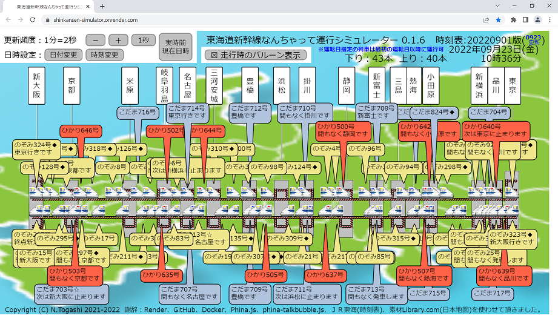

# 東海道新幹線なんちゃって運行シミュレーター
<DIV STYLE="text-align: right;">2021年10月14日 鉄道の日 公開</DIV>

## 概要

　東海道新幹線は、毎日多くの列車が走行していることはご存じのことと思います。
のぞみ号が止まる駅の時刻表を見ると、日中は毎時10本前後の列車（のぞみ号が6本、ひかり号が2本、こだま号が2本）
が発車しており、更に運転日指定の臨時列車も加わることがわかります（上下合わせると倍になります）。
また、東京駅と新大阪駅間の約500Kmを、のぞみ号は約2時間30分、ひかり号は約2時間54分、こだま号は約3時間54分で結んでおり、
上り下りの線路上にはそれぞれ約26本以上（のぞみ号が13本、ひかり号が6本、こだま号が7本）の列車が走行しているようです。
このような状況を見てみたいと考えて作成したのがこの運行シミュレーターです。

　実際の画面がこちらです。

　実際に見てみると想像以上の混雑ぶりでびっくりしました。特にのぞみ号の追い抜きぶりは凄くて、
こだま号やひかり号が可哀想になります。出張ではこだま号を使っていたため身に染みてわかります。

　<span style="color:red;">試しと言っては何ですが、ホームページ「[OYAJI PHOTO CLUB](https://oyaji-photo.club/dy/)」さんのドクターイエローの運行予想を勝手に取り入れさせて頂きました。どきどきしながら見る楽しみが増えました。ありがごうございます。</span>

　まだまだ不完全な部分が多いですが、ぼちぼち改善していきたいと考えています。

  - 列車は停車駅間を等速度で走行します。駅内徐行、加速、区間毎の最高速度、カーブでの減速などを実現したい。
  - 追い越しは次の通過駅に近づいた時に停車している列車があれば追い抜きます。通過時間を計算して追い越したい。
  - 各駅の構成や各列車が発着する番線も再現したい。
  - 線路を実際の地図に合わせた曲線にしたい。
  - 通過駅のアナウンスも表示したい。
  - 時刻表はＪＲ東海HPの時刻表から取得させて頂いていますが良い方法があれば改善したい。
  - ソースコードは作成しっぱなしなので整理したいし、テストコードも作成したい。
  - 山陽新幹線、東北新幹線、... まだまだ ...

　公開に際しては以下のサービスを使用させて頂きました。感謝致します。

  - [Render](https://render.com/)
  - [GitHub](https://github.com/)
  - [Docker Hub](https://hub.docker.com/)

　作成に際しては以下のソフトウェアおよびデータを使用させて頂きました。感謝致します。

  - [Phina.js](https://phinajs.com/)
  - [phina-talkbubble.js](https://github.com/pentamania/phina-talkbubble)
  - [ＪＲ東海](https://jr-central.co.jp/)の時刻表
  - [素材Library.com](https://www.sozai-library.com/)の[日本地図](https://www.sozai-library.com/sozai/2528)
  - [Ubuntu 18.04/22.04](https://ubuntu.com/)
  - [Python 3.6/3.10](https://www.python.org/)
  - [JPHoliday](https://github.com/Lalcs/jpholiday)
  - [requests-html](https://pypi.org/project/requests-html/)
  - [BeautifulSoup](https://www.crummy.com/software/BeautifulSoup/)
  - [OYAJI PHOTO CLUBさんのドクターイエロー](https://oyaji-photo.club/dy/)

## Renderで運用中

　以下のリンクから実際の動作を参照できます。※作業中で停止していたらごめんなさい。 m(\_.\_)m

  - <A HREF="https://shinkansen-simulator.onrender.com/" TARGET="_blank" REL="noopener noreferrer">東海道新幹線なんちゃって運行シミュレーター</A>

## Dockerコンテナで運用する場合

### 構築手順

  1. GitHubからプロジェクトを取得する。
     ```
     $ git clone --depth 1 https://github.com/togashigg/shinkansen-simulator.git
     ```
  2. プロジェクトのディレクトリに移動する。
     ```
     $ cd shinkansen-simulator
     ```
  3. Dockerイメージをビルドする。
     ```
     $ docker build -t shinkansen-simulator:latest .
     ```
  4. 永続化領域用ディレクトリを作成する。
     ```
     $ mkdir ~/timetable
     $ mkdir ~/timetable/cache
     $ cp -p shinkansen_simulator/timetable/cache/* ~/timetable/cache/
     $ mkdir ~/timetable/log
     $ mkdir ~/timetable/output
     $ mkdir ~/timetable/remarks
     $ cp -p shinkansen_simulator/timetable/remarks/* ~/timetable/remarks/
     ```
  5. Dockerコンテナを起動する。
     ```
     $ docker run -d --name shinkansen-simulator -p 80:8080 \
              --mount type=bind,src=${HOME}/timetable/cache,dst=/app/shinkansen_simulator/timetable/cache \
              --mount type=bind,src=${HOME}/timetable/log,dst=/app/shinkansen_simulator/timetable/log \
              --mount type=bind,src=${HOME}/timetable/output,dst=/app/shinkansen_simulator/timetable/output \
              --mount type=bind,src=${HOME}/timetable/remarks,dst=/app/shinkansen_simulator/timetable/remarks \
              shinkansen-simulator
     ```
  8. ブラウザでDockerコンテナのURLを開く。
     ```
     http://＜IPアドレス＞/
     
      ※＜IPアドレス＞には環境を構築したサーバのIPアドレスを指定してください。
     ```

### 最新の時刻表に更新する方法

　時刻表データ利用についてはＪＲ東海の許可を得ておりません。利用する際は自己責任で利用して下さい。

　なお、運転日指定列車の時刻表は運転日にのみ取得できます。全列車の時刻表を完成させるには毎日実行しなければなりません。

  1. 時刻表の記事ファイルを作成する。

     本プロジェクトの"shinkansen_simulator/timetable/remarks/"内のファイルを参考にして、
     最新の時刻表から記事ファイルを作成して、永続化用ディレクトリの"remarks"ディレクトリに
     格納する。

     ファイル名は重複を避けるために以下の規則で運用する。
     ```
       YYMMDD_yymmdd_remarks.csv
       
         ※YYMMDD：時刻表の開始日を西暦年の下2桁と月日を指定する。例：211001
         ※yymmdd：時刻表の終了日を西暦年の下2桁と月日で指定する。例：211031
     ```

  2. 以下のコマンドを実行してＪＲ東海HPより時刻表データを取得する。
     ```
     $ docker exec shinkansen-simulator \
              /app/shinkansen_simulator/timetable/get.sh [＜時刻表開始日＞ ＜時刻表終了日＞]
     
       ※＜時刻表開始日＞：時刻表の開始日をYYYYMMDDの８桁の数字で指定する。例：20211001
       ※＜時刻表終了日＞：時刻表の終了日をYYYYMMDDの８桁の数字で指定する。例：20211031
       ※時刻表開始日および時刻表終了日を省略した場合は実行当日を含む記事ファイルを参照する。
       ※実行時間は、初回および時刻表開始日は約4時間、その他は約20分～40分程度です。
     ```

### Renderでの構築手順（作成者メモ）

#### Renderにユーザ登録する

  1. Renderのユーザでない場合は、以下のURLを開いて新規登録を行う。

     https://render.com/

#### Renderにログインする

  1. Renderの以下のURLを開いてログインする。

     https://render.com/

#### 新規のアプリを作成する

  1. RenderにログインしてDashboardのサービス一覧画面で\[New +\] - \[Web Service\]を選択する。

     \[Create a new Web Service\]画面が表示される。

  2. 連携するGitHubのリポジトリを選択する。

     \[Connect a repository\]：

       連携するGitHubリポジトリの\[Connect\]ボタンをクリックする。
       ※初めてGitHubと連携する場合は、GitHubのIDで接続して連携するリポジトリを選定しておく必要がある。

     \[You are deploying a web service for \[GitHubのID\]/\[GitHubのリポジトリ名\].\]画面が表示される。

  3. 各項目に値を入力する。

     \[Name\]：

       公開するWeb Serviceの名前を英字で始まる英数字で入力する。Render内で一意な名前でなければならない。

     \[Root Directory\]：

       省略する。

     \[Environment\]：

       \[Python 3\]を選択する。

     \[Region\]：

       デフォルトで表示される値\[Oregon(US West)\]のままとする。

     \[Branch\]：

       デフォルトで表示される値\[main\]のままとする。

     \[Build Command\]：

       \[pip3 install -r requirements.txt\]を設定する。

     \[Start Command\]：

       \[python3 manage.py runserver 0.0.0.0:$PORT\]を設定する。

     \[Plans\]：

       デフォルトで選択されている\[Free\]のままとする。

  4. \[Create Web Service\]ボタンをクリックする。

     WEB SERVICE画面が表示される。

     ※最初のビルドが開始されている。10分程度で終了する。

     ※ただし、サービス開始までには更に5分程度かかる。

#### GitHubとの連携を設定する

  デフォルトで連携されている。GitHubのリポジトリが更新されるとビルドされる。


## 使用サービスおよび使用ソフトウェアのライセンスおよびポリシー

  - [Render](https://render.com/)
    ```
    Render Acceptable Use Policy

    Last Updated: June 15, 2021

    Your use of the Service is subject to this Acceptable Use Policy. If you are found to be in violation of our policies at any time, as determined by Render in its sole discretion, we may warn you or suspend or terminate your account. Please note that we may change our Acceptable Use Policy at any time, and pursuant to the Render Terms of Service (”Terms”), it is your responsibility to keep up-to-date with and adhere to the policies posted here. All capitalized terms used herein have the meanings stated in the Terms, unless stated otherwise.

    You agree not to engage in any of the following prohibited activities:

    1. copying, distributing, or disclosing any part of the Service in any medium, including without limitation by any automated or non-automated “scraping”;

    2. using any automated system, including without limitation “robots,” “spiders,” “offline readers,” etc., to access the Service in a manner that sends more request messages to the Render servers than a human can reasonably produce in the same period of time by using a conventional on-line web browser (except that Render grants the operators of public search engines revocable permission to use spiders to copy publicly available materials from the Service for the sole purpose of and solely to the extent necessary for creating publicly available searchable indices of the materials, but not caches or archives of such materials);

    3. transmitting spam, chain letters, or other unsolicited email;

    4. attempting to interfere with, compromise the system integrity or security or decipher any transmissions to or from the servers running the Service;

    5. taking any action that imposes, or may impose at our sole discretion an unreasonable or disproportionately large load on our infrastructure;

    6. uploading invalid data, viruses, worms, or other software agents through the Service;

    7. collecting or harvesting any personally identifiable information, including account names, from the Service;

    8. reselling, renting or leasing the Service to your own customers directly;

    9. impersonating another person or otherwise misrepresenting your affiliation with a person or entity, conducting fraud, hiding or attempting to hide your identity;

    10. interfering with the proper working of the Service;

    11. accessing any content on the Service through any technology or means other than those provided or authorized by the Service;

    12. using the Service to mine cryptocurrencies;

    13. bypassing the measures we may use to prevent or restrict access to the Service, including without limitation features that prevent or restrict use or copying of any content or enforce limitations on use of the Service or the content therein;

    14. or engaging in any unlawful or objectionable activities on the Service, as determined in our sole discretion.
    ---
    © Render 2022
    ```

  - [GitHub](https://github.com/)
    ```
    Site Policy on GitHub
    ...
    License
    CC0-1.0. Note that CC0-1.0 does not grant any trademark permissions.
    
    You're under no legal obligation to do so, but in the spirit of transparency and collaboration these policies are developed and shared with, you're encouraged to:
    
    Share your adapted policies under CC0-1.0 or other open terms
    Make your adaptations transparent by using a public repo to show changes you've made
    Let us know how you're using adapted policies
    ...
    ---
    © 2021 GitHub, Inc.
    ```

  - [Docker Hub](https://hub.docker.com/)
    ```
    Docker Terms of Service
    Effective as of: December 14, 2020
    ...
    16. Copyright Policy
    16.1 Docker has established the following process to respond to notices of alleged infringement that comply with the United States' Digital Millennium Copyright Act ("DMCA notices").
    
    16.2 If you believe that your copyrighted work has been copied in a way that constitutes copyright infringement and is accessible via the Service, please notify Docker's copyright agent, as set forth in the Digital Millennium Copyright Act of 1998 (DMCA). For your complaint to be valid under the DMCA, you must provide the following information in writing:
    
    a. An electronic or physical signature of a person authorized to act on behalf of the copyright owner;
    
    b. Identification of the copyrighted work that you claim is being infringed;
    
    c. Identification of the material that is claimed to be infringing and where it is located on the Service;
    
    d. Information reasonably sufficient to permit Docker to contact you, such as your address, telephone number, and e-mail address;
    
    e. A statement that you have a good faith belief that use of the material in the manner complained of is not authorized by the copyright owner, its agent, or law; and
    
    f. A statement, made under penalty of perjury, that the above information is accurate, and that you are the copyright owner or are authorized to act on behalf of the owner.
    
    Docker's Designated Copyright Agent to receive notifications of claimed infringement can be reached as follows:
    
    Attention: Copyright Agent
    Docker, Inc.
    3790 El Camino Real #1052
    Palo Alto CA 94306
    
    
    Email: dmca@docker.com
    
    For clarity, only DMCA notices should go to the Docker Designated Copyright Agent. Any other feedback, comments, requests for technical support or other communications should be directed to Docker through support@docker.com.
    ...
    ---
    © 2021 Docker Inc. All rights reserved
    ```

  - [Phina.js](https://phinajs.com/)
    ```
    phinajs/phina.js is licensed under the
    MIT License
    A short and simple permissive license with conditions only requiring preservation of copyright and license notices. Licensed works, modifications, and larger works may be distributed under different terms and without source code.
    ---
    MIT License

    Copyright (c) 2015 phi and other contributors, http://phinajs.com

    Permission is hereby granted, free of charge, to any person obtaining a copy
    of this software and associated documentation files (the "Software"), to deal
    in the Software without restriction, including without limitation the rights
    to use, copy, modify, merge, publish, distribute, sublicense, and/or sell
    copies of the Software, and to permit persons to whom the Software is
    furnished to do so, subject to the following conditions:

    The above copyright notice and this permission notice shall be included in all
    copies or substantial portions of the Software.

    THE SOFTWARE IS PROVIDED "AS IS", WITHOUT WARRANTY OF ANY KIND, EXPRESS OR
    IMPLIED, INCLUDING BUT NOT LIMITED TO THE WARRANTIES OF MERCHANTABILITY,
    FITNESS FOR A PARTICULAR PURPOSE AND NONINFRINGEMENT. IN NO EVENT SHALL THE
    AUTHORS OR COPYRIGHT HOLDERS BE LIABLE FOR ANY CLAIM, DAMAGES OR OTHER
    LIABILITY, WHETHER IN AN ACTION OF CONTRACT, TORT OR OTHERWISE, ARISING FROM,
    OUT OF OR IN CONNECTION WITH THE SOFTWARE OR THE USE OR OTHER DEALINGS IN THE
    SOFTWARE.
    ---
    Copyright © 2015 phi. All Rights Reserved.
    ```

  - [phina-talkbubble.js](https://github.com/pentamania/phina-talkbubble)
    ```
    LICENSE
    MIT
    ---
    Copyright (C) pentamania, https://github.com/pentamania
    ```

  - [ＪＲ東海](https://jr-central.co.jp/)の時刻表
    ```
    著作権について
    当サイトの著作権及び当サイトに含まれる文章、写真、映像、音楽、音声その他の著作物に関する著作権は、当社又は原著作者その他の権利者に帰属します。当サイトの著作物に関して、著作権法により認められている場合を除き、権利者の許諾なく複製、改変、転用、貸与、頒布、公衆送信その他一切の利用・処分等を行うことを禁止します。
    商標権について
    当サイトに掲載される当社の商号、商標、ロゴマーク等に関する権利は、当社に帰属します。これらを当社の許諾なく利用・処分等することを禁止します。
    ---
    ©Central Japan Railway Company All rights reserved.
    ```

  - [素材Library.com](https://www.sozai-library.com/)の日本地図
    ```
    ご利用規約
    すべての素材データを、個人利用法人利用問わず無料でダウンロードしお使いいただけますが、素材データの著作権は管理者に帰属しますので、著作権を侵害する行為は禁止させていただきます。 また、イラスト素材はJPGとEPSもしくはAI形式（まとめてZIPでダウンロードできます）（一部、EPS・AIデータが無いのもあり）が入ってますので、必要に応じて加工は自由にしていただいて問題ありませんが、注意点が少しありますので下記「ご利用に関してのお願い」をお読みくださいませ。

    ■ご利用に関してのお願い
    ・当サイトの素材の販売は禁止させていただきます。
    ・当サイトの素材の再配布は禁止させていただきます。
    ・当サイトの素材を加工した素材の配布も禁止させていただきます。
    ・会社・企業・団体などでの当サイトのイラストの使用は問題ありません。
    ・アダルト、公序良俗、宗教系、その他管理人が不快に感じるサイトや媒体で、当サイトのイラスト素材の利用は禁止しています。
    ・販売物への使用は禁止しています。
    ・当サイトのイラストを使用して、直接的（※1）・間接的（※2）に利益を得ることを禁止しています。
    ・※1 直接的とは、当サイトの素材を直接販売もしくは加工して販売することをさします。
    ・※2 間接的とは、当サイトの素材がきっかけもしくは当サイトの素材が無いと何か販売できない状態、または利益を出せない状態で使用されることをさします。
    ・当サイトのイラストの利用、ダウンロードに発生した障害や事故などに関していかなる保証も行いません。
    ・当サイトからのリンクを通じアクセスされるサービス、ウェブサイトについて、いかなる責任も負いません。
    ■免責事項
    ・当サイトのイラストデータをご利用いただく場合には、お客様のご判断と責任におきましてご利用をお願い申し上げます。
    ・イラスト素材データに関してのトラブルは当サイトでは、一切の責任を負いかねます事ご了承願います。
    ・カレンダー素材、地図素材の内容関しては万全を期してはおりますが、正確性、確実性を保証するものではありません。今後、予告なしに内容を変更または廃止する場合があります。
    ・地図素材のデータに関しては2014年7月に作成したデータとなります。市区町村合併などによりデータが古い場合がありますので、国土交通省などの地図と照らし合わせご利用することをおすすめいたします。
    ・イラスト素材データに関してのご質問に関しては、お答え致しかねる場合もございますのでご了承ください。
    ---
    Copyright(c)2012-2021 無料イラストの素材ライブラリー.com ALL RIGHTS RESERVED.
    ```

  - [Ubuntu 18.04/22.04](https://ubuntu.com/)
    ```
    Intellectual property rights policy
    Latest update: We updated this policy on 15 July 2015.
    
    Welcome to Canonical’s IPRights Policy. This policy is published by Canonical Limited (Canonical, we, us and our) under the Creative Commons CC-BY-SA version 3.0 UK licence.
    
    Canonical owns and manages certain intellectual property rights in Ubuntu and other associated intellectual property (Canonical IP) and licences the use of these rights to enterprises, individuals and members of the Ubuntu community in accordance with this IPRights Policy.
    
    Your use of Canonical IP is subject to:
    
    ✔ Your acceptance of this IPRights Policy;
    ✔ Your acknowledgement that Canonical IP is the exclusive property of Canonical and can only be used with Canonical’s permission (which can be revoked at any time); and
    ✔ You taking all reasonable steps to ensure that Canonical IP is used in a manner that does not affect either the validity of such Canonical IP or Canonical’s ownership of Canonical IP in any way; and that you will transfer any goodwill you derive from them to Canonical, if requested.
    
    Ubuntu is a trusted open source platform. To maintain that trust we need to manage the use of Ubuntu and the components within it very carefully. This way, when people use Ubuntu, or anything bearing the Ubuntu brand, they can be assured that it will meet the standards they expect. Your continued use of Canonical IP implies your acceptance and acknowledgement of this IPRights Policy.
    
    1. Summary
    
    ✔ You can download, install and receive updates to Ubuntu for free.
    ✔ You can modify Ubuntu for personal or internal commercial use.
    ✔ You can redistribute Ubuntu, but only where there has been no modification to it.
    ✔ You can use our copyright, patent and design materials in accordance with this IPRights Policy.
    ✔ You can be confident and can trust in the consistency of the Ubuntu experience.
    ✔ You can rely on the standard expected of Ubuntu.
    ✔ Ubuntu is an aggregate work; this policy does not modify or reduce rights granted under licences which apply to specific works in Ubuntu.
    
    2. Relationship to other licences
    
    Ubuntu is an aggregate work of many works, each covered by their own licence(s). For the purposes of determining what you can do with specific works in Ubuntu, this policy should be read together with the licence(s) of the relevant packages. For the avoidance of doubt, where any other licence grants rights, this policy does not modify or reduce those rights under those licences.
    
    3. Your use of Ubuntu
    
    ✔ You can download, install and receive updates to Ubuntu for free.
    ✔ Ubuntu is freely available to all users for personal, or in the case of organisations, internal use. It is provided for this use without warranty. All implied warranties are disclaimed to the fullest extent permitted at law.
    ✔ You can modify Ubuntu for personal or internal use
    ✔ You can make changes to Ubuntu for your own personal use or for your organisation’s own internal use.
    ✔ You can redistribute Ubuntu, but only where there has been no modification to it.
    ✔ You can redistribute Ubuntu in its unmodified form, complete with the installer images and packages provided by Canonical (this includes the publication or launch of virtual machine images).
    ✔ Any redistribution of modified versions of Ubuntu must be approved, certified or provided by Canonical if you are going to associate it with the Trademarks. Otherwise you must remove and replace the Trademarks and will need to recompile the source code to create your own binaries. This does not affect your rights under any open source licence applicable to any of the components of Ubuntu. If you need us to approve, certify or provide modified versions for redistribution you will require a licence agreement from Canonical, for which you may be required to pay. For further information, please contact us (as set out below).
    ✔ We do not recommend using modified versions of Ubuntu which are not modified in accordance with this IPRights Policy. Modified versions may be corrupted and users of such modified systems or images may find them to be inconsistent with the updates published by Canonical to its users. If they use the Trademarks, they are in contravention of this IPRights Policy. Canonical cannot guarantee the performance of such modified versions. Canonical’s updates will be consistent with every version of Ubuntu approved, certified or provided by Canonical.
    
    4. Your use of our trademarks
    
    Canonical’s Trademarks (registered in word and logo form) include:
    
    UBUNTU
    KUBUNTU
    EDUBUNTU
    XUBUNTU
    JUJU
    LANDSCAPE
    
    ✔ You can use the Trademarks, in accordance with Canonical’s brand guidelines, with Canonical’s permission in writing. If you require a Trademark licence, please contact us (as set out below).
    ✔ You will require Canonical’s permission to use: (i) any mark ending with the letters UBUNTU or BUNTU which is sufficiently similar to the Trademarks or any other confusingly similar mark, and (ii) any Trademark in a domain name or URL or for merchandising purposes.
    ✔ You cannot use the Trademarks in software titles. If you are producing software for use with or on Ubuntu you may reference Ubuntu, but must avoid: (i) any implication of endorsement, or (ii) any attempt to unfairly or confusingly capitalise on the goodwill of Canonical or Ubuntu.
    ✔ You can use the Trademarks in discussion, commentary, criticism or parody, provided that you do not imply endorsement by Canonical.
    ✔ You can write articles, create websites, blogs or talk about Ubuntu, provided that it is clear that you are in no way speaking for or on behalf of Canonical and that you do not imply endorsement by Canonical.
    
    Canonical reserves the right to review all use of Canonical’s Trademarks and to object to any use that appears outside of this IPRights Policy.
    
    5. Your use of our copyright, patent and design materials
    
    ✔ You can only use Canonical’s copyright materials in accordance with the copyright licences therein and this IPRights Policy.
    ✔ You cannot use Canonical’s patented materials without our permission.
    
    Copyright
    The disk, CD, installer and system images, together with Ubuntu packages and binary files, are in many cases copyright of Canonical (which copyright may be distinct from the copyright in the individual components therein) and can only be used in accordance with the copyright licences therein and this IPRights Policy.
    
    Patents
    Canonical has made a significant investment in the Open Invention Network, defending Linux, for the benefit of the open source ecosystem. Additionally, like many open source projects, Canonical also protects its interests from third parties by registering patents. You cannot use Canonical’s patented materials without our permission.
    
    Trade dress and look and feel
    Canonical owns intellectual property rights in the trade dress and look and feel of Ubuntu (including the Unity interface), along with various themes and components that may include unregistered design rights, registered design rights and design patents, your use of Ubuntu is subject to these rights.
    
    6. Logo use guidelines
    
    Canonical’s logos are presented in multiple colours and it is important that their visual integrity be maintained. It is therefore preferable that the logos should only be used in their standard form, but if you should feel the need to alter them in any way, you should following the guidelines set out below.
    
    [Ubuntu logo guidelines](https://design.ubuntu.com/brand/ubuntu-logo?_ga=2.53297455.648916006.1663810047-660850984.1649218076)
    [Canonical logo guidelines](https://design.ubuntu.com/brand/canonical-logo?_ga=2.250227201.648916006.1663810047-660850984.1649218076)
    
    7. Use of Canonical IP by the Ubuntu community
    
    Ubuntu is built by Canonical and the Ubuntu community. We share access rights owned by Canonical with the Ubuntu community for the purposes of discussion, development and advocacy. We recognise that most of the open source discussion and development areas are for non-commercial purposes and we therefore allow the use of Canonical IP in this context, as long as there is no commercial use and that the Canonical IP is used in accordance with this IPRights Policy.
    
    8. Contact us
    
    [Please contact us:](https://ubuntu.com/legal/terms-and-policies/contact-us)
    
    ✔ if you have any questions or would like further information on our IPRights Policy, Canonical or Canonical IP;
    ✔ if you would like permission from Canonical to use Canonical IP;
    ✔ if you require a licence agreement; or
    ✔ to report a breach of our IPRights Policy.
    
    Please note that due to the volume of mail we receive, it may take up to a week to process your request.
    
    9. Changes
    
    We may make changes to this IPRights Policy from time to time. Please check this IPRights Policy from time to time to ensure that you are in compliance.
    ---
    © 2022 Canonical Ltd. Ubuntu and Canonical are registered trademarks of Canonical Ltd.
    ```

  - [Python 3.6](https://www.python.org/)
    ```
    Terms and conditions for accessing or otherwise using Python
    PSF LICENSE AGREEMENT FOR PYTHON 3.6.15
    1. This LICENSE AGREEMENT is between the Python Software Foundation ("PSF"), and
       the Individual or Organization ("Licensee") accessing and otherwise using Python
       3.6.15 software in source or binary form and its associated documentation.

    2. Subject to the terms and conditions of this License Agreement, PSF hereby
       grants Licensee a nonexclusive, royalty-free, world-wide license to reproduce,
       analyze, test, perform and/or display publicly, prepare derivative works,
       distribute, and otherwise use Python 3.6.15 alone or in any derivative
       version, provided, however, that PSF's License Agreement and PSF's notice of
       copyright, i.e., "Copyright © 2001-2021 Python Software Foundation; All Rights
       Reserved" are retained in Python 3.6.15 alone or in any derivative version
       prepared by Licensee.

    3. In the event Licensee prepares a derivative work that is based on or
       incorporates Python 3.6.15 or any part thereof, and wants to make the
       derivative work available to others as provided herein, then Licensee hereby
       agrees to include in any such work a brief summary of the changes made to Python
       3.6.15.

    4. PSF is making Python 3.6.15 available to Licensee on an "AS IS" basis.
       PSF MAKES NO REPRESENTATIONS OR WARRANTIES, EXPRESS OR IMPLIED.  BY WAY OF
       EXAMPLE, BUT NOT LIMITATION, PSF MAKES NO AND DISCLAIMS ANY REPRESENTATION OR
       WARRANTY OF MERCHANTABILITY OR FITNESS FOR ANY PARTICULAR PURPOSE OR THAT THE
       USE OF PYTHON 3.6.15 WILL NOT INFRINGE ANY THIRD PARTY RIGHTS.

    5. PSF SHALL NOT BE LIABLE TO LICENSEE OR ANY OTHER USERS OF PYTHON 3.6.15
       FOR ANY INCIDENTAL, SPECIAL, OR CONSEQUENTIAL DAMAGES OR LOSS AS A RESULT OF
       MODIFYING, DISTRIBUTING, OR OTHERWISE USING PYTHON 3.6.15, OR ANY DERIVATIVE
       THEREOF, EVEN IF ADVISED OF THE POSSIBILITY THEREOF.

    6. This License Agreement will automatically terminate upon a material breach of
       its terms and conditions.

    7. Nothing in this License Agreement shall be deemed to create any relationship
       of agency, partnership, or joint venture between PSF and Licensee.  This License
       Agreement does not grant permission to use PSF trademarks or trade name in a
       trademark sense to endorse or promote products or services of Licensee, or any
       third party.

    8. By copying, installing or otherwise using Python 3.6.15, Licensee agrees
       to be bound by the terms and conditions of this License Agreement.
    ---
    © Copyright 2001-2021, Python Software Foundation.
    ```

  - [Python 3.10](https://www.python.org/)
    ```
    Terms and conditions for accessing or otherwise using Python
    Python software and documentation are licensed under the PSF License Agreement.

    Starting with Python 3.8.6, examples, recipes, and other code in the documentation are dual licensed under the PSF License Agreement and the Zero-Clause BSD license.

    Some software incorporated into Python is under different licenses. The licenses are listed with code falling under that license. See Licenses and Acknowledgements for Incorporated Software for an incomplete list of these licenses.

    PSF LICENSE AGREEMENT FOR PYTHON 3.10.7
    1. This LICENSE AGREEMENT is between the Python Software Foundation ("PSF"), and
       the Individual or Organization ("Licensee") accessing and otherwise using Python
       3.10.7 software in source or binary form and its associated documentation.

    2. Subject to the terms and conditions of this License Agreement, PSF hereby
       grants Licensee a nonexclusive, royalty-free, world-wide license to reproduce,
       analyze, test, perform and/or display publicly, prepare derivative works,
       distribute, and otherwise use Python 3.10.7 alone or in any derivative
       version, provided, however, that PSF's License Agreement and PSF's notice of
       copyright, i.e., "Copyright © 2001-2022 Python Software Foundation; All Rights
       Reserved" are retained in Python 3.10.7 alone or in any derivative version
       prepared by Licensee.

    3. In the event Licensee prepares a derivative work that is based on or
       incorporates Python 3.10.7 or any part thereof, and wants to make the
       derivative work available to others as provided herein, then Licensee hereby
       agrees to include in any such work a brief summary of the changes made to Python
       3.10.7.

    4. PSF is making Python 3.10.7 available to Licensee on an "AS IS" basis.
       PSF MAKES NO REPRESENTATIONS OR WARRANTIES, EXPRESS OR IMPLIED.  BY WAY OF
       EXAMPLE, BUT NOT LIMITATION, PSF MAKES NO AND DISCLAIMS ANY REPRESENTATION OR
       WARRANTY OF MERCHANTABILITY OR FITNESS FOR ANY PARTICULAR PURPOSE OR THAT THE
       USE OF PYTHON 3.10.7 WILL NOT INFRINGE ANY THIRD PARTY RIGHTS.

    5. PSF SHALL NOT BE LIABLE TO LICENSEE OR ANY OTHER USERS OF PYTHON 3.10.7
       FOR ANY INCIDENTAL, SPECIAL, OR CONSEQUENTIAL DAMAGES OR LOSS AS A RESULT OF
       MODIFYING, DISTRIBUTING, OR OTHERWISE USING PYTHON 3.10.7, OR ANY DERIVATIVE
       THEREOF, EVEN IF ADVISED OF THE POSSIBILITY THEREOF.

    6. This License Agreement will automatically terminate upon a material breach of
       its terms and conditions.

    7. Nothing in this License Agreement shall be deemed to create any relationship
       of agency, partnership, or joint venture between PSF and Licensee.  This License
       Agreement does not grant permission to use PSF trademarks or trade name in a
       trademark sense to endorse or promote products or services of Licensee, or any
       third party.

    8. By copying, installing or otherwise using Python 3.10.7, Licensee agrees
       to be bound by the terms and conditions of this License Agreement.
    ---
    © Copyright 2001-2022, Python Software Foundation.
    ```

  - [JPHoliday](https://github.com/Lalcs/jpholiday)
    ```
    Lalcs/jpholiday is licensed under the
    MIT License
    A short and simple permissive license with conditions only requiring preservation of copyright and license notices. Licensed works, modifications, and larger works may be distributed under different terms and without source code.
    ---
    MIT License
    
    Copyright (c) 2017 
    
    Permission is hereby granted, free of charge, to any person obtaining a copy
    of this software and associated documentation files (the "Software"), to deal
    in the Software without restriction, including without limitation the rights
    to use, copy, modify, merge, publish, distribute, sublicense, and/or sell
    copies of the Software, and to permit persons to whom the Software is
    furnished to do so, subject to the following conditions:
    
    The above copyright notice and this permission notice shall be included in all
    copies or substantial portions of the Software.
    
    THE SOFTWARE IS PROVIDED "AS IS", WITHOUT WARRANTY OF ANY KIND, EXPRESS OR
    IMPLIED, INCLUDING BUT NOT LIMITED TO THE WARRANTIES OF MERCHANTABILITY,
    FITNESS FOR A PARTICULAR PURPOSE AND NONINFRINGEMENT. IN NO EVENT SHALL THE
    AUTHORS OR COPYRIGHT HOLDERS BE LIABLE FOR ANY CLAIM, DAMAGES OR OTHER
    LIABILITY, WHETHER IN AN ACTION OF CONTRACT, TORT OR OTHERWISE, ARISING FROM,
    OUT OF OR IN CONNECTION WITH THE SOFTWARE OR THE USE OR OTHER DEALINGS IN THE
    SOFTWARE.
    ```

  - [requests-html](https://pypi.org/project/requests-html/)
    ```
    License: MIT License (MIT)
    The MIT License (MIT)
    
    Copyright 2018 Kenneth Reitz
    
    Permission is hereby granted, free of charge, to any person obtaining a copy
    of this software and associated documentation files (the "Software"), to deal
    in the Software without restriction, including without limitation the rights
    to use, copy, modify, merge, publish, distribute, sublicense, and/or sell
    copies of the Software, and to permit persons to whom the Software is
    furnished to do so, subject to the following conditions:
    
    The above copyright notice and this permission notice shall be included in all
    copies or substantial portions of the Software.
    
    THE SOFTWARE IS PROVIDED "AS IS", WITHOUT WARRANTY OF ANY KIND, EXPRESS OR
    IMPLIED, INCLUDING BUT NOT LIMITED TO THE WARRANTIES OF MERCHANTABILITY,
    FITNESS FOR A PARTICULAR PURPOSE AND NONINFRINGEMENT. IN NO EVENT SHALL THE
    AUTHORS OR COPYRIGHT HOLDERS BE LIABLE FOR ANY CLAIM, DAMAGES OR OTHER
    LIABILITY, WHETHER IN AN ACTION OF CONTRACT, TORT OR OTHERWISE, ARISING FROM,
    OUT OF OR IN CONNECTION WITH THE SOFTWARE OR THE USE OR OTHER DEALINGS IN THE
    SOFTWARE.
    ```

  - [BeautifulSoup](https://www.crummy.com/software/BeautifulSoup/)
    ```
    Attribution-ShareAlike 2.0 Generic (CC BY-SA 2.0)
    This is a human-readable summary of (and not a substitute for) the license. Disclaimer.
    You are free to:
    Share — copy and redistribute the material in any medium or format
    Adapt — remix, transform, and build upon the material
    for any purpose, even commercially.
    This license is acceptable for Free Cultural Works.
    The licensor cannot revoke these freedoms as long as you follow the license terms.
    Under the following terms:
    Attribution — You must give appropriate credit, provide a link to the license, and indicate if changes were made. You may do so in any reasonable manner, but not in any way that suggests the licensor endorses you or your use.
    
    ShareAlike — If you remix, transform, or build upon the material, you must distribute your contributions under the same license as the original.
    
    No additional restrictions — You may not apply legal terms or technological measures that legally restrict others from doing anything the license permits.
    Notices:
    You do not have to comply with the license for elements of the material in the public domain or where your use is permitted by an applicable exception or limitation.
    No warranties are given. The license may not give you all of the permissions necessary for your intended use. For example, other rights such as publicity, privacy, or moral rights may limit how you use the material.
    A new version of this license is available. You should use it for new works, and you may want to relicense existing works under it. No works are automatically put under the new license, however.
    ---
    Crummy is © 1996-2021 Leonard Richardson. Unless otherwise noted, all text licensed under a Creative Commons License.
    ```

----
Copyright (C) N.Togashi 2021-2022
